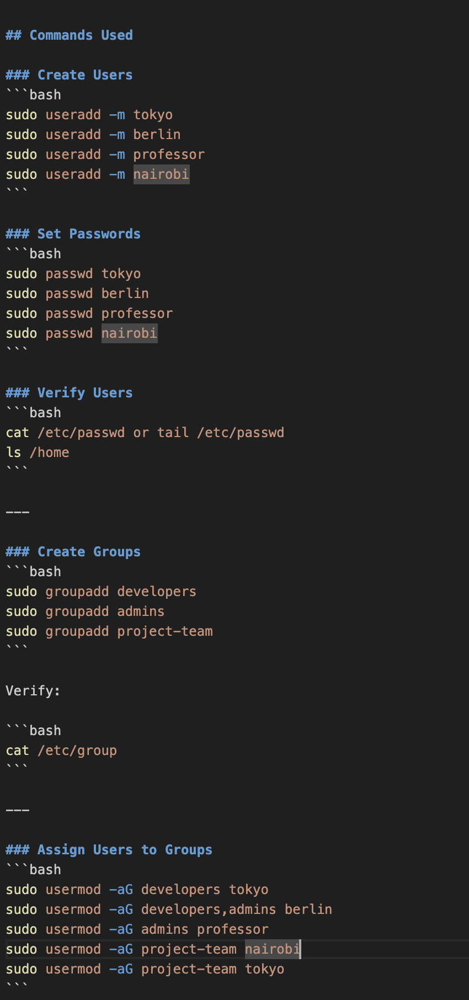

# Day 09 – Linux User & Group Management Challenge

Today I completed a hands-on Linux challenge focused on user and group management.  
The objective was to understand how access control works in multi-user environments — a core responsibility in DevOps operations.

---

## Users & Groups Created

### Users
- tokyo  
- berlin  
- professor  
- nairobi  

### Groups
- developers  
- admins  
- project-team  

---

## Group Assignments

| User       | Groups Assigned |
|------------|----------------|
| tokyo      | developers, project-team |
| berlin     | developers, admins |
| professor  | admins |
| nairobi    | project-team |

Verified using:

```bash
id username
```

---

## Directories Created

| Directory | Group Owner | Permissions |
|------------|--------------|--------------|
| /opt/dev-project | developers | 775 |
| /opt/team-workspace | project-team | 775 |

Verified with:

```bash
ls -ld /opt/dev-project
ls -ld /opt/team-workspace
```

---

## Commands Used

### Create Users
```bash
sudo useradd -m tokyo
sudo useradd -m berlin
sudo useradd -m professor
sudo useradd -m nairobi
```

### Set Passwords
```bash
sudo passwd tokyo
sudo passwd berlin
sudo passwd professor
sudo passwd nairobi
```

### Verify Users
```bash
cat /etc/passwd or tail /etc/passwd
ls /home
```

---

### Create Groups
```bash
sudo groupadd developers
sudo groupadd admins
sudo groupadd project-team
```

Verify:

```bash
cat /etc/group
```

---

### Assign Users to Groups
```bash
sudo usermod -aG developers tokyo
sudo usermod -aG developers,admins berlin
sudo usermod -aG admins professor
sudo usermod -aG project-team nairobi
sudo usermod -aG project-team tokyo
```

Verify memberships:

```bash
id tokyo
id berlin
id professor
id nairobi
```

---

### Shared Directory Setup
```bash
sudo mkdir -p /opt/dev-project
sudo chown :developers /opt/dev-project
sudo chmod 775 /opt/dev-project
```

Test access:

```bash
sudo -u tokyo touch /opt/dev-project/file1
sudo -u berlin touch /opt/dev-project/file2
```

Both users successfully created files.

---

### Team Workspace Setup
```bash
sudo mkdir /opt/team-workspace
sudo chown :project-team /opt/team-workspace
sudo chmod 775 /opt/team-workspace
```

Test:

```bash
sudo -u nairobi touch /opt/team-workspace/teamfile
```

Access confirmed.

---

## Troubleshooting

### Issue: Permission Denied

A user initially could not create files inside the shared directory.

**Diagnosis:**
Checked directory permissions.

```bash
ls -ld /opt/dev-project
```

**Fix:**
Ensured correct group ownership.

```bash
sudo chown :developers /opt/dev-project
```

---

### Important Lesson — Always Use `-a` with usermod

Incorrect:

```bash
sudo usermod -G developers tokyo
```

This removes the user from existing groups.

Correct:

```bash
sudo usermod -aG developers tokyo
```

`-a` means append and prevents accidental permission removal.

---

## What I Learned

- Linux groups simplify access control across teams.
- Proper permissions are critical for system security.
- Testing access by switching users ensures correct configuration.
- Misconfigured permissions can block collaboration or expose sensitive data.
- Role-based access is a foundational DevOps skill.

---

## Real-World DevOps Use

This lab simulated how organizations manage:

- Developer access to shared projects  
- Admin privileges  
- Secure team collaboration  

Effective user and permission management helps prevent production incidents and security risks.
