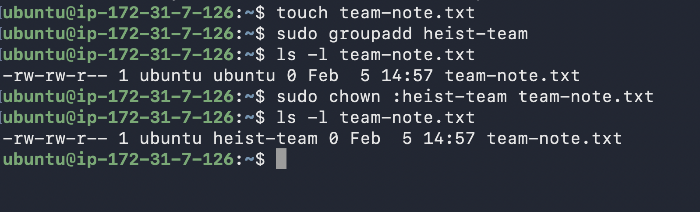
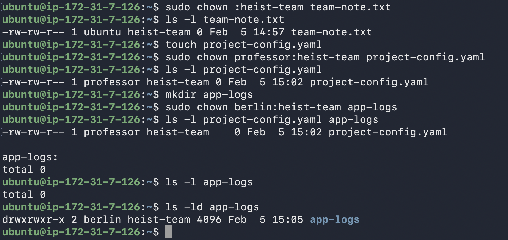

# Day 11 Challenge – File Ownership (chown & chgrp)

---

## Task 1 — Understanding Ownership

Check file ownership:

`ls -l`

Ownership format:

-rw-r--r-- 1 owner group size date filename  

Owner → primary controller of the file  
Group → shared access layer for users  

**Difference:**
- Owner can modify permissions and transfer ownership.
- Group members get access based on assigned permissions.

---

## Task 2 — Basic chown Operations

Create users:

`sudo useradd tokyo`  
`sudo useradd berlin`

Create file:

`touch devops-file.txt`

Check owner:

`ls -l devops-file.txt`

Change owner:

`sudo chown tokyo devops-file.txt`  
`sudo chown berlin devops-file.txt`

Verify:

`ls -l devops-file.txt`

---

## Task 3 — Basic chgrp Operations

Create file:

`touch team-notes.txt`

Create group:

`sudo groupadd heist-team`

Check group:

`ls -l team-notes.txt`

Change group:

`sudo chgrp heist-team team-notes.txt`

Verify:

`ls -l team-notes.txt`

---

## Task 4 — Combined Owner & Group Change

Create user:

`sudo useradd professor`

Create file:

`touch project-config.yaml`

Change owner and group:

`sudo chown professor:heist-team project-config.yaml`

Create directory:

`mkdir app-logs`

Assign ownership:

`sudo chown berlin:heist-team app-logs`

Verify:

`ls -l project-config.yaml`  
`ls -ld app-logs`

---

## Task 5 — Recursive Ownership

Create directory structure:

`mkdir -p heist-project/vault`  
`mkdir -p heist-project/plans`

Create files:

`touch heist-project/vault/gold.txt`  
`touch heist-project/plans/strategy.conf`

Create group:

`sudo groupadd planners`

Apply recursive ownership:

`sudo chown -R professor:planners heist-project`

Verify:

`ls -lR heist-project`

---

## Task 6 — Practice Challenge

Create user:

`sudo useradd nairobi`

Create groups:

`sudo groupadd vault-team`  
`sudo groupadd tech-team`

Create directory:

`mkdir bank-heist`

Create files:

`touch bank-heist/access-codes.txt`  
`touch bank-heist/blueprints.pdf`  
`touch bank-heist/escape-plan.txt`

Assign ownership:

`sudo chown tokyo:vault-team bank-heist/access-codes.txt`  
`sudo chown berlin:tech-team bank-heist/blueprints.pdf`  
`sudo chown nairobi:vault-team bank-heist/escape-plan.txt`

Verify:

`ls -l bank-heist`

---

## Commands Used

touch  
mkdir  
mkdir -p  
ls -l  
ls -ld  
ls -lR  
useradd  
groupadd  
chown  
chgrp  

---

## What I Learned

- Ownership determines who controls a file or directory.
- `chown user:group` assigns owner and group in a single command.
- Recursive ownership simplifies permission management across directories.
