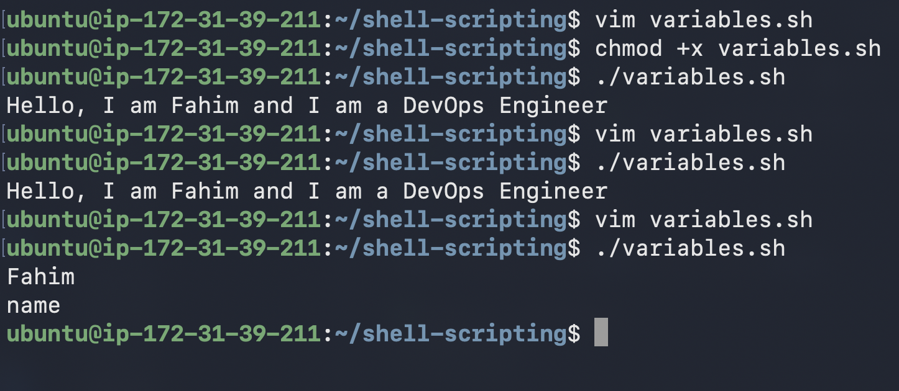
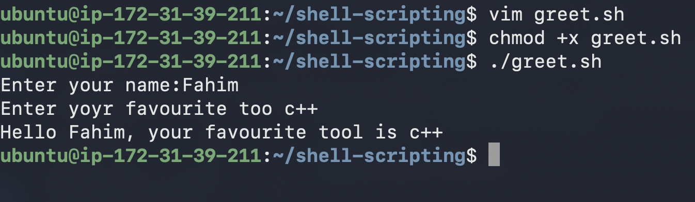
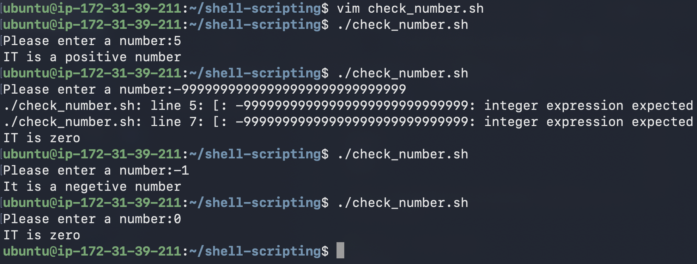
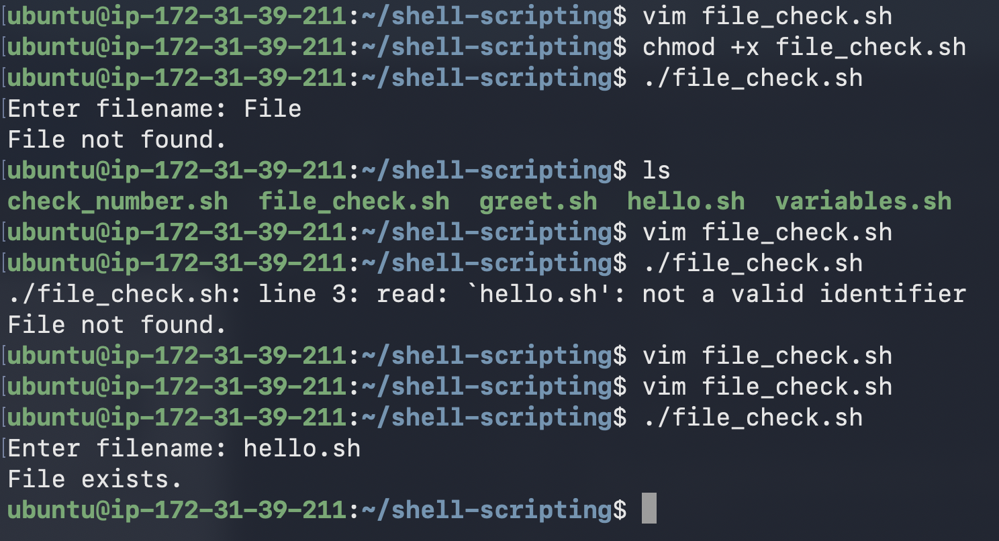
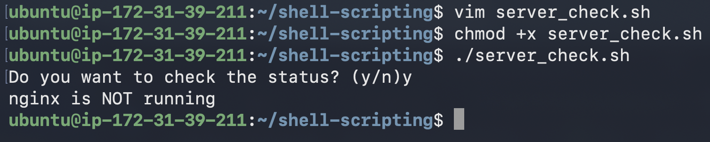

# Day 16 – Shell Scripting Basics

## 🎯 Goal
Learn the fundamental building blocks of shell scripting that every DevOps engineer must know:

- Shebang
- Variables
- User input
- Conditional logic
- Automation mindset

---

# ✅ Task 1 — Your First Script

## hello.sh

```bash
#!/bin/bash
echo "Hello, DevOps!"
```

### Run

```bash
chmod +x hello.sh
./hello.sh
```


---

## ❓ What Happens If You Remove the Shebang?

- The script might still run in the current shell.
- But it can fail in other shells (`sh`, `zsh`) due to syntax differences.
- Execution becomes unpredictable.

---

# ✅ Task 2 — Variables

## variables.sh

```bash
#!/bin/bash

NAME="Fahim"
ROLE="DevOps Engineer"

echo "Hello, I am $NAME and I am a $ROLE"
```

### Output

```
Hello, I am Fahim and I am a DevOps Engineer
```



---

## 🔎 Single vs Double Quotes

```bash
echo '$NAME'
echo "$NAME"
```

### Output

```
$NAME
Fahim
```

| Quote | Behavior |
|--------|------------|
| `' '` | Prints literal text |
| `" "` | Expands variables |

👉 Use **double quotes** in production scripts.

---

# ✅ Task 3 — User Input

## greet.sh

```bash
#!/bin/bash

read -p "Enter your name: " NAME
read -p "Enter your favourite tool: " TOOL

echo "Hello $NAME, your favourite tool is $TOOL"
```
 


---

# ✅ Task 4 — If-Else Conditions

## check_number.sh

```bash
#!/bin/bash

read -p "Enter a number: " NUM

if [ "$NUM" -gt 0 ]; then
    echo "Positive"
elif [ "$NUM" -lt 0 ]; then
    echo "Negative"
else
    echo "Zero"
fi
```


---

## file_check.sh

```bash
#!/bin/bash

read -p "Enter filename: " FILE

if [ -f "$FILE" ]; then
    echo "File exists."
else
    echo "File not found."
fi
```

👉 `-f` checks whether a real file exists (not a directory).



---

# ✅ Task 5 — Combine Everything (Real DevOps Style)

## server_check.sh

```bash
#!/bin/bash

service="nginx"
read -p "Do you want to check the status? (y/n): " Yes

if [ "$Yes" = "y" ]; then
    status=$(systemctl is-active $service)

    if [ "$status" = "active" ]; then
        echo "$service is running"
    else
        echo "$service is NOT running"
    fi

else
    echo "Skipped"
fi

```



---

# 🔥 Key Learnings

### ✅ Always Use Shebang
Ensures scripts run with the correct interpreter and prevents unpredictable failures.

---

### ✅ Quote my Variables

```bash
"$FILE"
```

Protects scripts from crashing when values contain spaces or are empty.

---

### ✅ Think Like an Automation Engineer

Production scripts rely on **exit codes**, not printed text.

Example:

```bash
systemctl is-active --quiet nginx
```

Fast. Clean. Reliable.

---

# 📂 Folder Structure

```
2026/
 └── day-16/
      ├── hello.sh
      ├── variables.sh
      ├── greet.sh
      ├── check_number.sh
      ├── file_check.sh
      ├── server_check.sh
```

---

# 🚀 Reflection

Today marked a transition from manually executing Linux commands to building automation through shell scripts.

I learned how to:

- Write executable scripts  
- Use variables and user input  
- Apply conditional logic  
- Perform real service checks  

Shell scripting is a foundational DevOps skill because production environments depend heavily on reliable automation.

---

#90DaysOfDevOps #ShellScripting #DevOpsJourney
