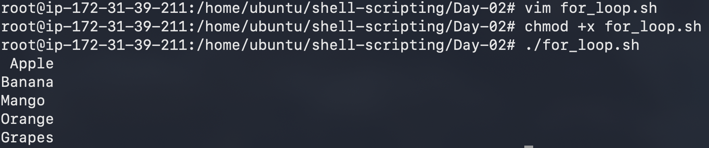
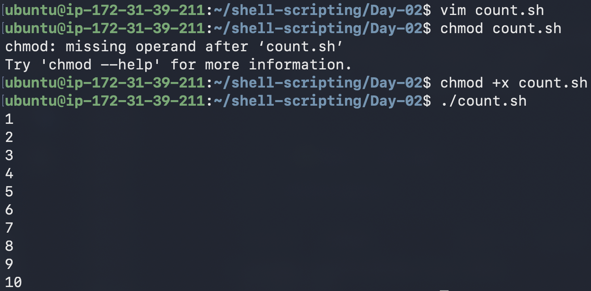
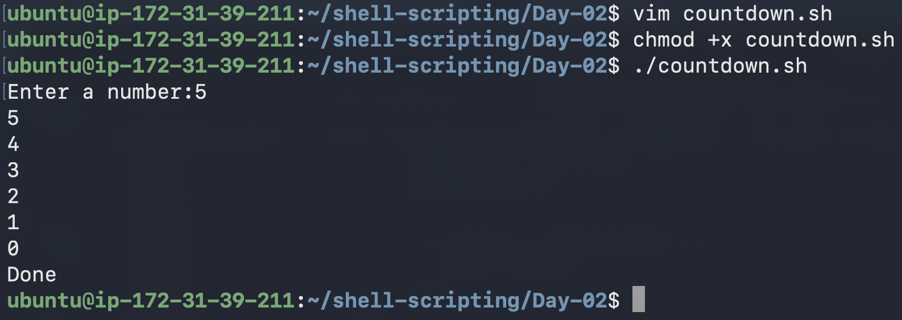
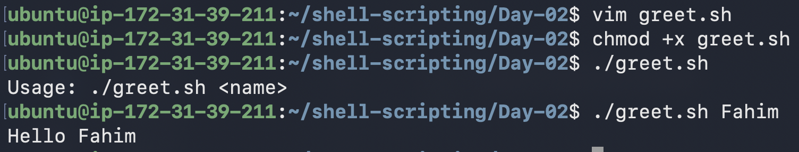
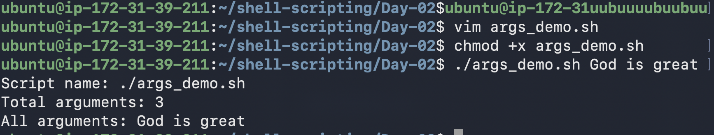
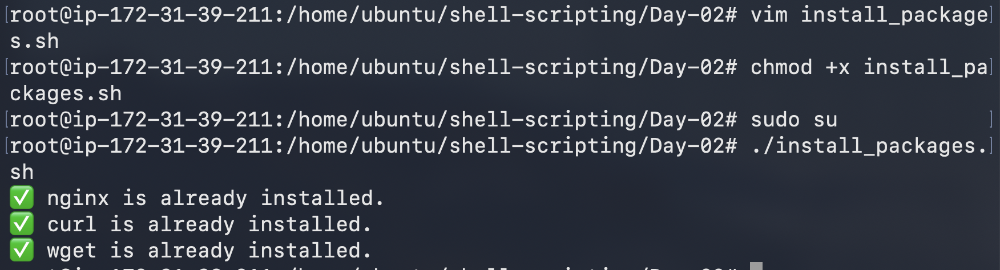
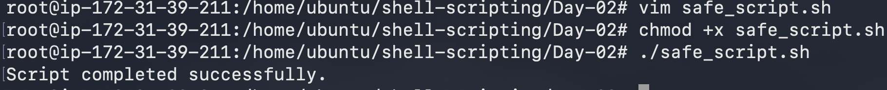

# Day 17 – Shell Scripting: Loops, Arguments & Error Handling

## 🎯 Goal
Strengthen shell scripting skills by learning loops, command-line arguments, package automation, and basic error handling — all essential for real DevOps workflows.

---

# ✅ Task 1 — For Loop

## for_loop.sh

```bash
#!/bin/bash

fruits=("Apple" "Banana" "Mango" "Orange" "Grapes")

for fruit in "${fruits[@]}"; do
    echo "$fruit"
done
```



---

## count.sh

```bash
#!/bin/bash

for i in {1..10}; do
    echo "$i"
done
```



---

# ✅ Task 2 — While Loop

## countdown.sh

```bash
#!/bin/bash

read -p "Enter a number: " num

while [ "$num" -ge 0 ]; do
    echo "$num"
    ((num--))
done

echo "Done!"
```



---

# ✅ Task 3 — Command-Line Arguments

## greet.sh

```bash
#!/bin/bash

if [ -z "$1" ]; then
    echo "Usage: ./greet.sh <name>"
    exit 1
fi

echo "Hello, $1!"
```

### Example Run

```bash
./greet.sh God is great
```


---

## args_demo.sh

```bash
#!/bin/bash

echo "Script name: $0"
echo "Total arguments: $#"
echo "All arguments: $@"
```

### Example Run

```bash
./args_demo.sh God is great
```



---

# ✅ Task 4 — Install Packages via Script

## install_packages.sh

```bash
#!/bin/bash

# Ensure script runs as root
if [ "$EUID" -ne 0 ]; then #Effective user ID = EUID
    echo "Please run as root."
    exit 1 # break or cursh
fi

packages=("nginx" "curl" "wget")

# Update once
apt-get update -y &> /dev/null # update information will go to null of dev directory

for pkg in "${packages[@]}"; do

    if dpkg -s "$pkg" &> /dev/null; then #dpkg= debian package command
        echo "✅ $pkg is already installed."
    else
        echo "Installing $pkg..."

        apt-get install -y "$pkg" || {     # || → failure, && → success
            echo "❌ Failed to install $pkg"
            exit 1
        }

        echo "🚀 $pkg installed successfully."
    fi

done

~    
```



---

# ✅ Task 5 — Error Handling

## safe_script.sh

```bash
#!/bin/bash

set -e  # Exit immediately if a command fails

mkdir /tmp/devops-test || echo "Directory already exists"

cd /tmp/devops-test || {
    echo "Failed to enter directory"
    exit 1
}

touch test-file.txt || echo "Failed to create file"

echo "Script completed successfully."
```



---

# 🔥 Key Learnings

### ✅ 1. Loops Enable Automation
Loops eliminate repetitive commands — a core DevOps skill.

---

### ✅ 2. Arguments Make Scripts Flexible
Using `$1`, `$@`, and `$#` allows scripts to adapt dynamically instead of being hardcoded.

---

### ✅ 3. Error Handling Prevents Silent Failures
Using `set -e` and conditional checks ensures scripts fail fast and predictably — critical in production systems.

---

# 📂 Folder Structure

```
2026/
 └── day-17/
      ├── for_loop.sh
      ├── count.sh
      ├── countdown.sh
      ├── greet.sh
      ├── args_demo.sh
      ├── install_packages.sh
      ├── safe_script.sh
```

---

# 🚀 Reflection

Today’s scripting exercises introduced powerful techniques that move shell usage from manual command execution toward real automation.

By learning loops, arguments, and error handling, I took another step toward thinking like a DevOps engineer — focusing on reliability, scalability, and efficiency when managing systems.

