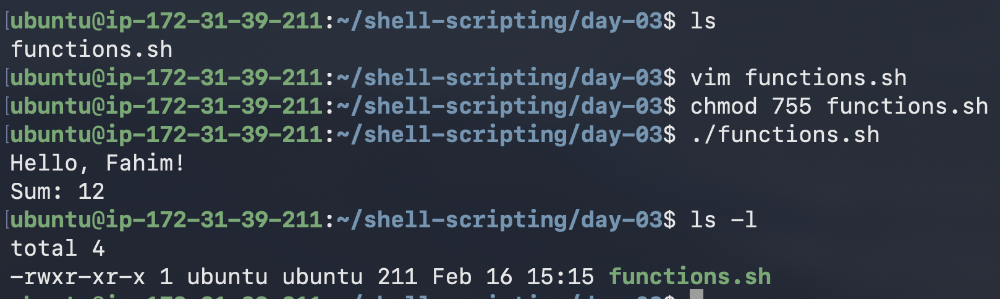
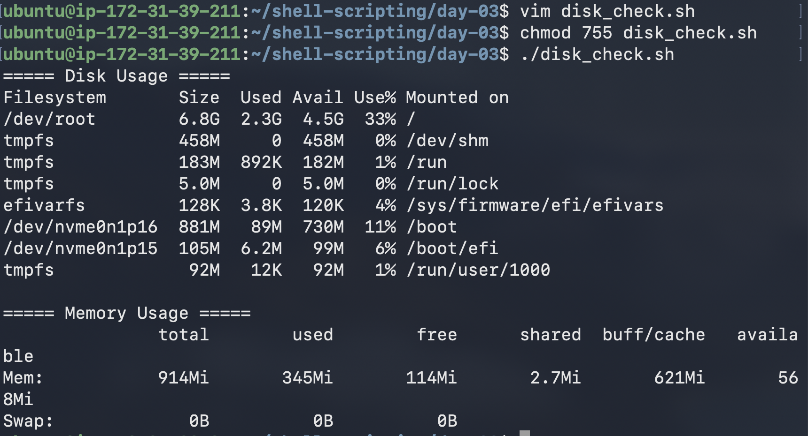
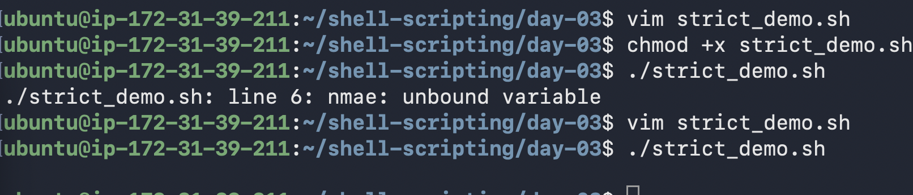
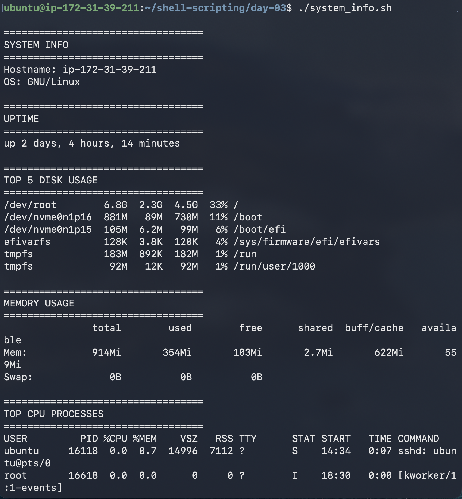

# Day 18 — Shell Scripting: Functions & Slightly Advanced Concepts

## Objective
Learn to write reusable shell scripts using functions, enable strict mode for safer execution, understand local variables, and build a production-style system information reporter.

---

## ✅ Script 1 — Basic Functions (`functions.sh`)

```bash
#!/bin/bash

# greet function
greet() {
    local name=$1
    echo "Hello, $name!"
}

# add function
add() {
    local a=$1
    local b=$2
    echo "Sum: $((a + b))"
}

# calling functions
greet "Fahim"
add 5 7
```


---

## ✅ Script 2 — Disk & Memory Checker (`disk_check.sh`)

```bash
#!/bin/bash

check_disk() {
    echo "===== Disk Usage ====="
    df -h /
}

check_memory() {
    echo "===== Memory Usage ====="
    free -h
}

main() {
    check_disk
    echo
    check_memory
}

main
```

---

## ✅ Script 3 — Strict Mode Demo (`strict_demo.sh`)

```bash
#e
#!/bin/bash
set -euo pipefail

echo "Strict mode enabled"

# Uncomment ONE at a time to test behavior

#!/bin/bash
set -u

name="Fahim"

echo $nmae

#e
#!/bin/bash
set -e

echo "Start"

false   # this command always fails

echo "End"


# set -o pipefail → pipeline fails if any command fails
# grep "test" missing.txt | sort


```

---

## 🔎 What Each Flag Does

### set -e
Stops the script immediately if any command fails.  
Prevents partial execution in automation.

### set -u
Throws an error when using an undefined variable.  
Protects against typos and incorrect variable names.

### set -o pipefail
If any command in a pipeline fails, the entire pipeline fails.  
Important for log parsing, monitoring, and CI pipelines.

👉 Production-grade scripts commonly start with:

```bash
set -euo pipefail
```

---

## ✅ Script 4 — Local Variables (`local_demo.sh`)

```bash
#!/bin/bash

global_var="I am global"

use_local() {
    local local_var="I exist only inside the function"
    echo "$local_var"
}

leak_variable() {
    leaked_var="I leaked outside!" #Global variable
}

use_local
echo "$global_var"

leak_variable
echo "$leaked_var" #First call function then prinf
```


### Observation

✅ `local_var` is NOT accessible outside the function.  
❌ `leaked_var` becomes global because `local` was not used.

👉 Prefer `local` inside functions to avoid unpredictable bugs.

---

## ✅ Script 5 — Production Style System Info Reporter (`system_info.sh`)

```bash
#!/bin/bash
set -euo pipefail

header() {
    echo
    echo "=================================="
    echo "$1"
    echo "=================================="
}

system_info() {
    header "SYSTEM INFO"
    echo "Hostname: $(hostname)"
    echo "OS: $(uname -o)"
}

uptime_info() {
    header "UPTIME"
    uptime -p
}

disk_usage() {
    header "TOP 5 DISK USAGE"
    df -h | sort -hr -k5 | head -n 6
}

memory_usage() {
    header "MEMORY USAGE"
    free -h
}

cpu_usage() {
    header "TOP CPU PROCESSES"
    ps aux --sort=-%cpu | head -n 6
}

main() {
    system_info
    uptime_info
    disk_usage
    memory_usage
    cpu_usage
}

main
```



Clean and structured output improves readability and operational clarity.

---

## 📚 Key Learnings

### ✅ Functions improve reusability  
Write once, use multiple times.

### ✅ Strict mode increases safety  
Reduces silent failures in automation.

### ✅ Local variables prevent side effects  
Limits unexpected behavior and simplifies debugging.

---

## 🚀 Strong shell scripting directly improves operational efficiency.
