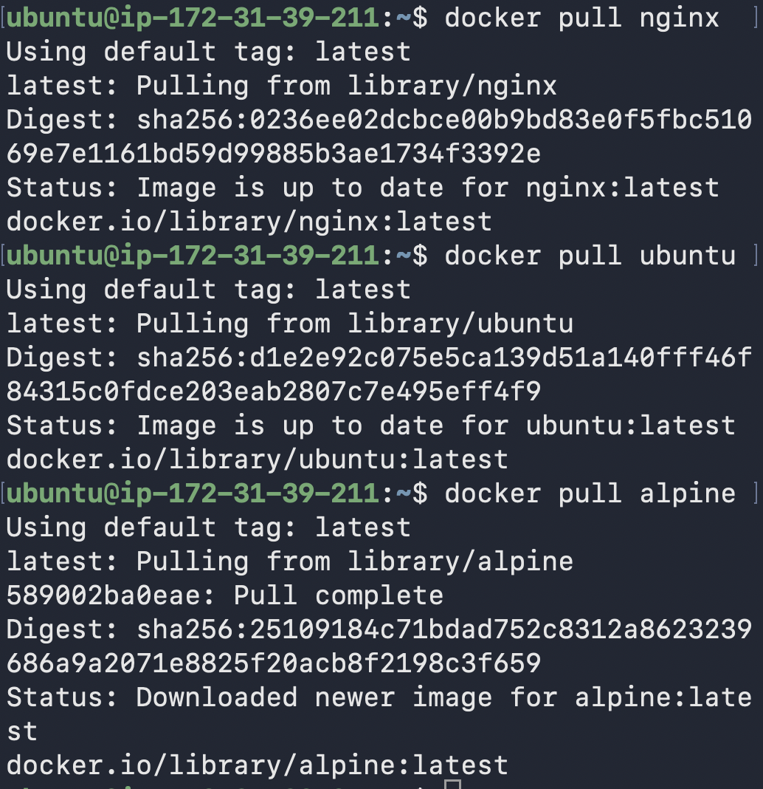
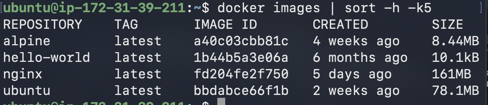
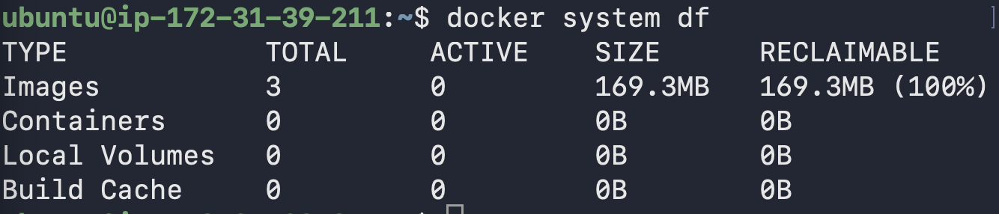

# 🚀 Day 30 – Docker Images & Container Lifecycle

## 🎯 Goal
Understand:
- What is a Docker image
- What are layers
- Full container lifecycle
- Working with running containers
- Cleanup

---

# 🐳 Task 1 – Docker Images

## Pull Images

```bash
docker pull nginx
docker pull ubuntu
docker pull alpine
```


## List Images

```bash
docker images
```


### Observation
- ubuntu → bigger size
- alpine → very small (~5MB)

### Why Alpine Smaller?
Alpine is minimal Linux.
Ubuntu includes more packages and tools.

---

## Inspect Image

```bash
docker inspect nginx
```

You can see:
- Image ID
- Created date
- Layers
- Exposed ports
- Environment variables

---

## Remove Image

```bash
# 1️⃣ Check all containers (running + stopped)
docker ps -a

# 2️⃣ Stop container (if running)
docker stop <container_id>

# 3️⃣ Remove container (must remove ALL ubuntu containers)
docker rm <container_id>

# Example (multiple containers)
docker rm e57bdebf8d63 9cb4e0c822bd 33f0747f89f8

# 4️⃣ Now remove the image
docker rmi ubuntu
```

---

# 🧱 Task 2 – Image Layers

```bash
docker image history nginx
```

Each row = one layer.

FROM debian:trixie
RUN apt-get update
RUN apt-get install -y nginx
COPY index.html /var/www/html/
ENV APP_ENV=production
CMD ["nginx", "-g", "daemon off;"]

### What are Layers?

Docker images are built in layers.
Each layer = filesystem change.

Why Docker uses layers:
- Faster build (caching)
- Reuse layers
- Save storage
- Faster pull/push

---

# 🔄 Task 3 – Container Lifecycle

## Create (not running)

```bash
docker create --name test nginx
```

Check:

```bash
docker ps -a
```

State: created

---

## Start

```bash
docker start test
```

State: running

---

## Pause

```bash
docker pause test
```

State: paused

---

## Unpause

```bash
docker unpause test
```

State: running

---

## Stop

```bash
docker stop test
```

State: exited

---

## Restart

```bash
docker restart test
```

State: running

---

## Kill

```bash
docker kill test
```

Force stop immediately.

---

## Remove

```bash
docker rm test
```

State: removed

---

# 🧪 Task 4 – Working with Running Containers

## Run Nginx (Detached)

```bash
docker run -d -p 8080:80 --name web nginx
```

---

## View Logs

```bash
docker logs web
```

---

## Real-Time Logs

```bash
docker logs -f web
```
Image history = Build time
Docker logs = Runtime

---

## Exec into Container

```bash
docker exec -it web bash
```

Explore filesystem:

```bash
ls /
```

---

## Run Single Command Without Entering

```bash
docker exec web ls /usr/share/nginx/html
```

---

## Inspect Container

```bash
docker inspect web
```

Find:
- IP address
- Port mappings
- Mount points
- Network info

---

# 🧹 Task 5 – Cleanup

## Stop All Running Containers

```bash
docker stop $(docker ps -q)
```

---

## Remove All Containers

```bash
docker rm $(docker ps -aq)
```

---

## Remove Unused Images

```bash
docker image prune
```

---

## Check Docker Disk Usage

```bash
docker system df
```

---

# 🧠 Key Concepts

- Image = Blueprint
- Container = Running instance
- Layers = Stacked filesystem changes
- Docker uses caching for speed
- Container lifecycle has multiple states
- Cleanup prevents disk waste

---

# ✅ Day 30 Completed

✔ Images pulled  
✔ Layers understood  
✔ Lifecycle practiced  
✔ Logs explored  
✔ Cleanup done  
