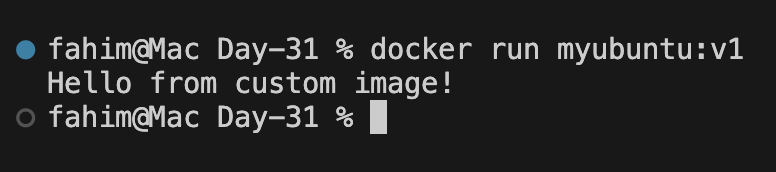
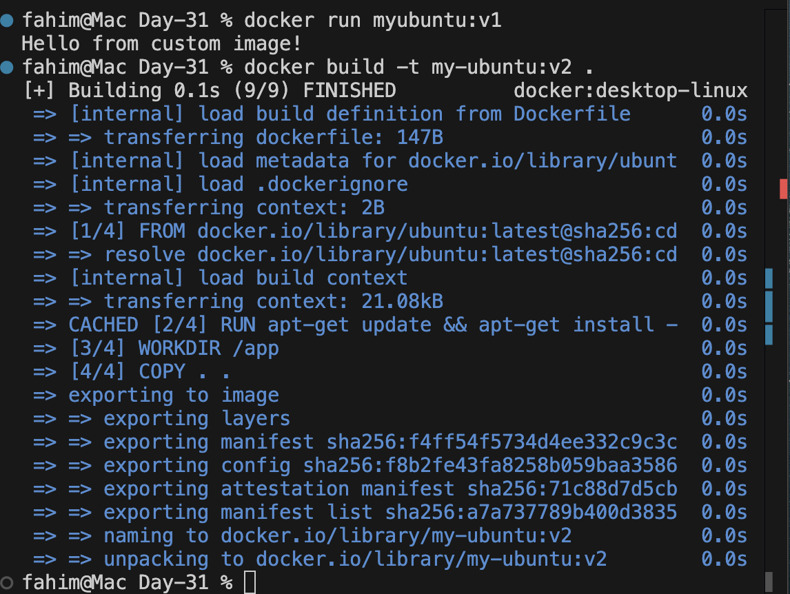
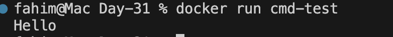
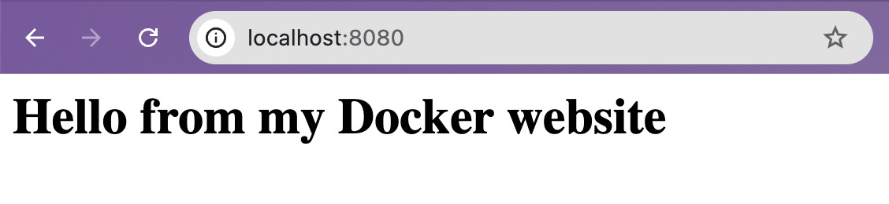

# Day 31 – Dockerfile: Build Your Own Images

## Objective
Learn how to create custom Docker images using Dockerfiles and understand common Dockerfile instructions.

---

# Task 1 — My First Docker Image

## Project Structure

```
my-first-image/
 └ Dockerfile
```

## Dockerfile

```dockerfile
FROM ubuntu:latest

RUN apt-get update && apt-get install -y curl

CMD ["echo", "Hello from my custom image!"]
```

## Build Image

```bash
docker build -t my-ubuntu:v1 .
```

## Run Container

```bash
docker run my-ubuntu:v1
```

## Output

```
Hello from my custom image!
```

---

# Task 2 — Dockerfile Instructions

## Dockerfile

```dockerfile
FROM ubuntu:latest

RUN apt-get update && apt-get install -y curl

WORKDIR /app

COPY . .

EXPOSE 8080

CMD ["bash"]
```


## Explanation

| Instruction | Purpose |
|---|---|
| FROM | Defines the base image |
| RUN | Executes commands during image build |
| COPY | Copies files from host to image |
| WORKDIR | Sets working directory inside container |
| EXPOSE | Documents container port |
| CMD | Default command when container starts |

---

# Task 3 — CMD vs ENTRYPOINT

## CMD Example

Dockerfile:

```dockerfile
FROM ubuntu
CMD ["echo", "hello"]
```

Build:

```bash
docker build -t cmd-test .
```

Run:

```bash
docker run cmd-test
```

Output:

```
hello
```

Override command:

```bash
docker run cmd-test echo hi
```

Output:

```
hi
```

Observation: CMD can be overridden when running the container.


---

## ENTRYPOINT Example

Dockerfile:

```dockerfile
FROM ubuntu
ENTRYPOINT ["echo"]
```

Build:

```bash
docker build -t entry-test .
```

Run:

```bash
docker run entry-test hello
```

Output:

```
hello
```

Observation: ENTRYPOINT always runs and arguments are appended.

---

# Task 4 — Build a Simple Web App Image

## Project Structure

```
my-website/
 ├ Dockerfile
 └ index.html
```

## index.html

```html
<h1>Hello from my Docker Website</h1>
```

## Dockerfile

```dockerfile
FROM nginx:alpine

COPY index.html /usr/share/nginx/html

EXPOSE 80
```

## Build Image

```bash
docker build -t my-website:v1 .
```

## Run Container

```bash
docker run -d -p 8080:80 my-website:v1
```

Open in browser:

```
http://localhost:8080
```


---

# Task 5 — .dockerignore

## .dockerignore

```
node_modules
.git
*.md
.env
```

Purpose: Prevents unnecessary files from being included in the Docker build context.

---

# Task 6 — Build Optimization

## Example

Bad order:

```dockerfile
COPY . .
RUN npm install
```

Better order:

```dockerfile
COPY package.json .
RUN npm install
COPY . .
```

### Why Layer Order Matters

Docker caches layers during build. If frequently changing files are copied early, Docker must rebuild all subsequent layers. Proper ordering improves build speed.

---


# Key Learnings

- Dockerfile instructions create image layers
- RUN and COPY modify the filesystem
- ENV, CMD, EXPOSE are metadata instructions
- CMD provides default container commands
- ENTRYPOINT defines a fixed executable
- `.dockerignore` reduces build context size
- Layer ordering improves Docker build performance