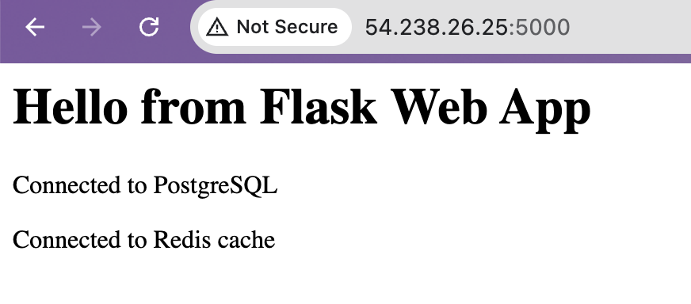

# Day 34 – Docker Compose Advanced (Sequential Build Approach)

## 🎯 Objective

Build a production-like multi-container system step-by-step using Docker Compose.

---

# ✅ Task-1: Basic 3-Service Stack

### docker-compose.yml (Initial)

```yaml
services:

  db:
    image: postgres:16
    environment:
      POSTGRES_DB: mydb
      POSTGRES_USER: user
      POSTGRES_PASSWORD: pass

  redis:
    image: redis:7

  web:
    build: ./app
    ports:
      - "5000:5000"
    environment:
      DB_HOST: db
      DB_NAME: mydb
      DB_USER: user
      DB_PASSWORD: pass
      REDIS_HOST: redis
```

### Architecture

Internet → Web → DB / Redis

---

# ✅ Task-2: Add Healthcheck & Dependency

```yaml
db:
  healthcheck:
    test: ["CMD-SHELL", "pg_isready -U user -d mydb"]
    interval: 5s
    timeout: 3s
    retries: 5

web:
  depends_on:
    db:
      condition: service_healthy
```

Learning:

* Web waits until DB becomes ready.

---

# ✅ Task-3: Add Restart Policy

```yaml
db:
  restart: always
```

Learning:

* Database auto-recovers after crash.

---

# ✅ Task-4: Custom Dockerfile Build

```yaml
web:
  build: ./app
```

Learning:

* Application image built locally.
* Enables rebuild workflow:

```bash
docker compose up -d --build
```

---

# ✅ Task-5: Add Named Volume & Custom Network

```yaml
db:
  volumes:
    - postgres_data:/var/lib/postgresql/data
  networks:
    - backend_net

web:
  networks:
    - backend_net

redis:
  networks:
    - backend_net

volumes:
  postgres_data:

networks:
  backend_net:
```

Learning:

* Persistent database storage.
* Internal container communication via private network.


---

# ✅ Task-6: Scaling Concept

Scaling command:

```bash
docker compose up -d --scale web=3
```

Observation:

* Only one container can bind host port.
* Scaling requires load balancing layer.

### Architecture (Without Load Balancer)

```
Internet
   |
   ↓
web (public)
   |
backend_net
   |
Postgres + Redis
```

Learning:

* Horizontal scaling limitation with static port mapping.
* Foundation concept for Kubernetes orchestration.

---

# 🚀 Key Commands

Start:

```bash
docker compose up -d --build
```

Scale:

```bash
docker compose up -d --scale web=3
```

Stop:

```bash
docker compose down
```

---

# 🧠 Key DevOps Learnings

* Multi-container orchestration
* Health-aware service dependency
* Stateless vs Stateful architecture
* Persistent storage design
* Docker networking fundamentals
* Horizontal scaling limitations
* Reverse proxy requirement for scaling
* Kubernetes readiness mindset

---

# 🔥 Outcome

Built a progressively evolving container architecture demonstrating real-world DevOps deployment patterns.
