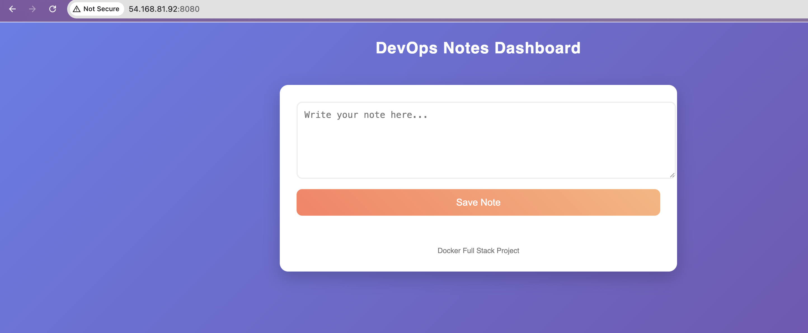

# Day 36 – Docker Project: Dockerize a Full Application

---

## Task 1 – Pick Your App

I built a **DevOps Notes Dashboard** full-stack web application.

This app allows users to:

- create operational notes
- delete notes
- store notes in database
- access via browser UI

Reason:

- Real internal DevOps tool simulation  
- Requires frontend + backend + database  
- Demonstrates reverse proxy architecture  
- Shows persistent storage design  
- Suitable for real deployment workflow  

Architecture:

Browser → Nginx → Flask API → PostgreSQL → Docker Volume

---

## Task 2 – Write the Dockerfile

### Backend Structure

```
backend/
 ├── app.py
 ├── db.py
 ├── requirements.txt
 └── Dockerfile
```

### app.py

```python
from flask import Flask,request,jsonify
from db import get_conn

app = Flask(__name__)

@app.route("/notes",methods=["GET"])
def get_notes():
    conn=get_conn()
    cur=conn.cursor()
    cur.execute("select id,content from notes order by id desc")
    rows=cur.fetchall()
    cur.close()
    conn.close()
    return jsonify([{"id":r[0],"content":r[1]} for r in rows])

@app.route("/notes",methods=["POST"])
def add_note():
    data=request.json
    conn=get_conn()
    cur=conn.cursor()
    cur.execute("insert into notes(content) values(%s)",(data["content"],))
    conn.commit()
    cur.close()
    conn.close()
    return jsonify({"msg":"ok"})

@app.route("/notes/<int:id>",methods=["DELETE"])
def delete_note(id):
    conn=get_conn()
    cur=conn.cursor()
    cur.execute("delete from notes where id=%s",(id,))
    conn.commit()
    cur.close()
    conn.close()
    return jsonify({"msg":"deleted"})

if __name__=="__main__":
    app.run(host="0.0.0.0",port=5000)
```

### db.py

```python
import psycopg2,os

def get_conn():
    return psycopg2.connect(
        host=os.getenv("DB_HOST"),
        user=os.getenv("DB_USER"),
        password=os.getenv("DB_PASSWORD"),
        dbname=os.getenv("DB_NAME")
    )
```

### requirements.txt

```
flask
psycopg2-binary
```

### Dockerfile

```dockerfile
FROM python:3.11-slim

WORKDIR /app

COPY requirements.txt .
RUN pip install --no-cache-dir -r requirements.txt

COPY . .

RUN useradd -m appuser
USER appuser

EXPOSE 5000

CMD ["python","app.py"]
```

### .dockerignore

```
__pycache__
*.pyc
.git
.env
```

Build test:

```
docker build -t devops-notes .
docker run -p 5000:5000 devops-notes
```

---

## Task 3 – Add Docker Compose

### Project Structure

```
day-36/
 ├── backend/
 ├── frontend/
 │    └── index.html
 ├── nginx.conf
 ├── docker-compose.yml
 └── .env
```

### docker-compose.yml

```yaml
services:

  nginx:
    image: nginx:alpine
    ports:
      - "8080:80"
    volumes:
      - ./frontend:/usr/share/nginx/html
      - ./nginx.conf:/etc/nginx/conf.d/default.conf
    depends_on:
      - backend
    networks:
      - notesnet

  backend:
    build: ./backend
    env_file:
      - .env
    depends_on:
      - db
    networks:
      - notesnet

  db:
    image: postgres:16-alpine
    env_file:
      - .env
    volumes:
      - notesdata:/var/lib/postgresql/data
    networks:
      - notesnet

volumes:
  notesdata:

networks:
  notesnet:
```

### nginx.conf

```
server {

 listen 80;

 location / {
   root /usr/share/nginx/html;
   index index.html;
 }

 location /api/ {
   proxy_pass http://backend:5000/;
 }

}
```

### .env

```
DB_HOST=db
DB_USER=postgres
DB_PASSWORD=postgres
DB_NAME=notesdb

POSTGRES_DB=notesdb
POSTGRES_PASSWORD=postgres
```

Run:

```
docker compose up --build
```

Access:

```
http://SERVER_IP:8080
```

---

## Task 4 – Ship It

Image pushed to Docker Hub:

```
docker login
docker build -t fahim017803/devops-notes:v1 backend/ #taking from github repo
docker push fahim017803/devops-notes:v1
```

---

## Task 5 – Test Whole Flow

All containers removed then tested:

```
docker system prune -a
docker compose up
```

System successfully rebuilt from project files.


---

## Challenges

- Database hostname issue → fixed using service name  
- Reverse proxy routing → fixed nginx config  
- Data loss → fixed docker volume  
- Fresh deployment testing → validated portability  

---

## Final Learning

This project demonstrated real DevOps workflow:

Build → Containerize → Orchestrate → Push → Deploy Anywhere